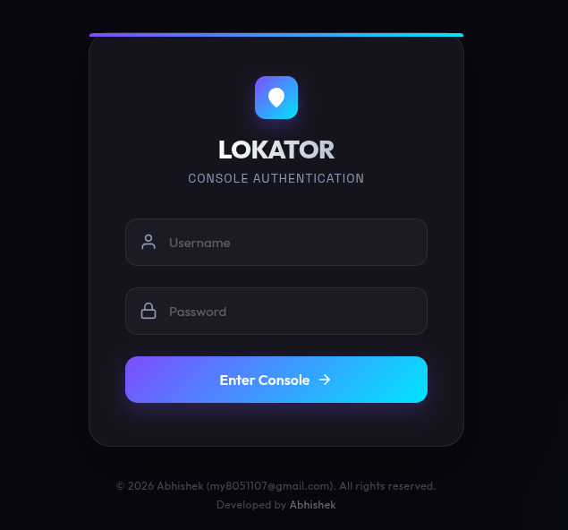
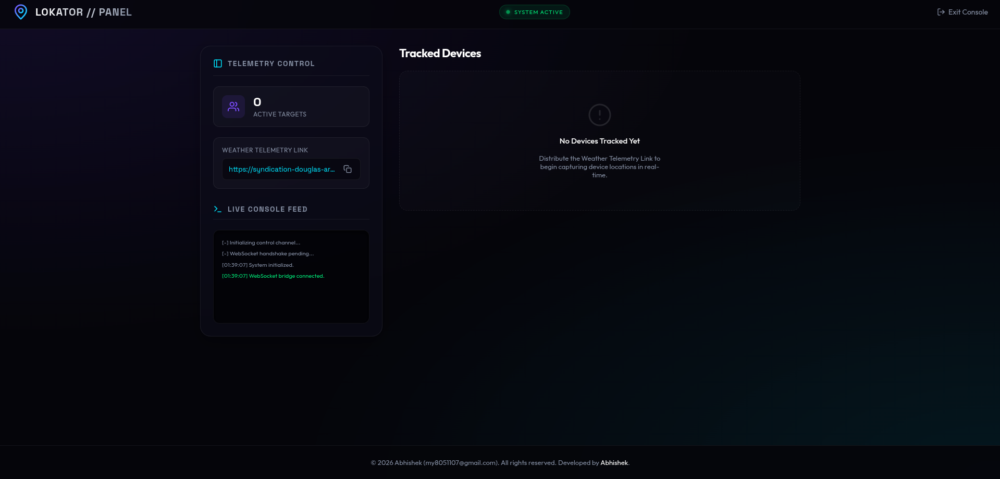
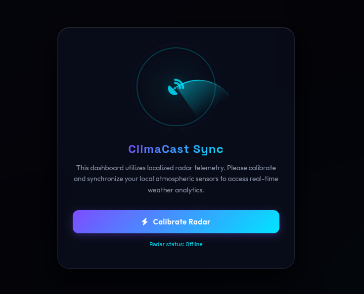
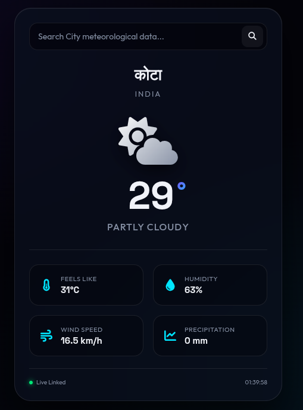

<div align="center">

# 📍 Live Location Tracker

### 🚀 Real-Time GPS Tracking Web Application

A modern, responsive, and educational web application built using **Node.js**, **Express.js**, **HTML**, **CSS**, and **JavaScript** to demonstrate real-time location tracking with an interactive map.

<p>


</p>


</div>

---

# 📖 About

**Live Location Tracker** is a lightweight Node.js web application that demonstrates how to obtain a user's current GPS location and display it on an interactive map. The project also includes a simple user interface and weather information to help learners understand location-based web applications.

---

# ✨ Features

- 📍 Real-Time GPS Tracking
- 🗺️ Interactive Map
- 🌦️ Weather Information
- 🔐 Login Page
- 📱 Responsive Design
- ⚡ Fast Performance
- 🌍 Latitude & Longitude Display
- 🚀 Express.js Backend
- 💻 Beginner Friendly Code

---

# 🛠️ Tech Stack

| Technology | Description |
|------------|-------------|
| Node.js | Backend Runtime |
| Express.js | Web Framework |
| HTML5 | Page Structure |
| CSS3 | Styling |
| JavaScript | Frontend Logic |

---

# 📂 Project Structure

```text
Live-Location-Tracker/
│
├── public/
│   ├── css/
│   ├── js/
│   └── images/
│
├── views/
│   ├── login.html
│   ├── home.html
│   ├── map.html
│   └── weather.html
│
├── server.js
├── router.js
├── config.js
├── package.json
├── package-lock.json
├── LICENSE
└── README.md
```

---

# 📸 Application Preview

## 🔐 Secure Login Console



Modern authentication interface with a premium cyber-inspired design.

---

## 🖥️ Admin Control Panel




Real-time monitoring dashboard with telemetry control, live console feed, weather link generation, and tracked device management.

---

## 📡 Weather Synchronization



Radar calibration interface for synchronizing weather telemetry and atmospheric data.

---

## 🌦️ Weather Dashboard



# ⚙️ Installation

Clone the repository

```bash
git clone https://github.com/abhishek-raj8051/Live-Location-Tracker.git
```

Move into the project

```bash
cd Live-Location-Tracker
```

Install dependencies

```bash
npm install
```

Start the server

```bash
npm start
```

or

```bash
node server.js
```

Open your browser

```
http://localhost:3000
```


# 🔑 Demo Login Credentials

Use the following demo credentials to access the application:

| Field | Value |
|-------|-------|
| Username | `abhishek` |
| Password | `abhishek` |

> **Note:** These credentials are provided only for demonstration and educational purposes.


---

# 🎓 Educational Purpose

This project has been developed **solely for educational, learning, and demonstration purposes**.

The objective of this project is to help students and developers learn:

- Real-Time GPS Location Tracking
- Node.js & Express.js Development
- Interactive Map Integration
- Frontend & Backend Communication
- Location-Based Web Applications

This repository is intended only for **education and skill development**.

---

# ⚠️ Disclaimer

This project **must not be used for unauthorized tracking, surveillance, or privacy violations**.

Users are responsible for obtaining proper consent before using any location-based functionality involving other individuals.

The author assumes **no responsibility** for misuse of this project.

---

# 🔒 Security Notice

This repository is designed for:

- Educational Demonstrations
- Academic Learning
- Personal Practice
- Portfolio Showcase

It is **not** intended for production deployment without additional security, authentication, validation, and privacy controls.

---

# 🚀 Future Improvements

- User Authentication
- Database Integration
- Live Tracking History
- Route Navigation
- Push Notifications
- Dark Mode
- Mobile Application
- Admin Dashboard
- Multi User Support

---

# 🤝 Contributing

Contributions are welcome.

1. Fork the repository.
2. Create a new branch.
3. Make your changes.
4. Commit your changes.
5. Push to your branch.
6. Open a Pull Request.

---

# 👨‍💻 Author

## Abhishek Raj

🎓 B.Tech Cyber Security Student

🏫 GLA University

💻 Passionate about Web Development & Cyber Security

🔗 GitHub

https://github.com/abhishek-raj8051

---

# 📄 License

This project is licensed under the **MIT License**.

---

<div align="center">

## ⭐ If you found this project helpful, please consider giving it a Star!

Made with ❤️ by **Abhishek Raj**

</div>